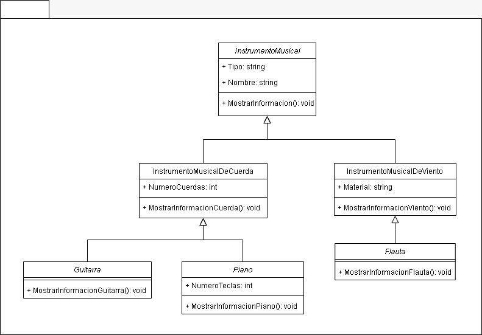

# Ejercicio: Generalización y Especificación

## Ejercicio 4: Instrumento Musical y Sus Derivados

### Descripción General

En este ejercicio, se definen varias clases relacionadas con instrumentos musicales. `InstrumentoMusical` es la clase base, y de ella derivan `InstrumentoMusicalDeCuerdas` e `InstrumentoMusicalDeViento`. A su vez, `InstrumentoMusicalDeCuerdas` tiene dos clases derivadas: `Guitarra` y `Piano`, mientras que `InstrumentoMusicalDeViento` tiene una clase derivada: `Trompeta`.

### Diagrama de Clases

     

### Consigna

1. Define una nueva clase llamada `InstrumentoMusicalPercusion` que herede de `InstrumentoMusical`.
2. Añade una propiedad específica para `InstrumentoMusicalPercusion` y crea un método para mostrar la información del instrumento de percusión.
3. Instancia un objeto de la clase `InstrumentoMusicalPercusion` y muestra su información.

### Pilares Aplicados

- **Abstracción**: Uso de propiedades y métodos para manejar la información de los instrumentos musicales.
- **Herencia**: Las clases `InstrumentoMusicalDeCuerdas` e `InstrumentoMusicalDeViento` heredan de `InstrumentoMusical`. Las clases `Guitarra`, `Piano` y `Trompeta` heredan de sus respectivas clases base.
- **Polimorfismo**: Uso de métodos con el mismo nombre en clases derivadas que llaman a los métodos de la clase base, mostrando información adicional específica.

---
